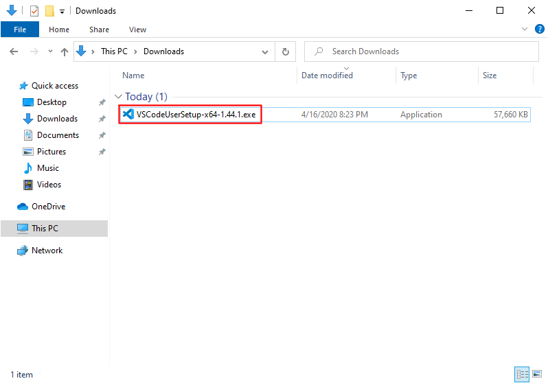
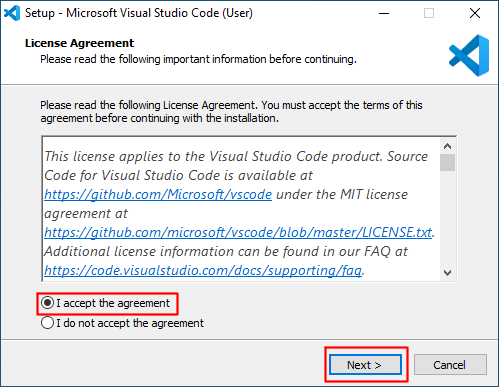
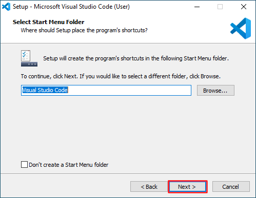
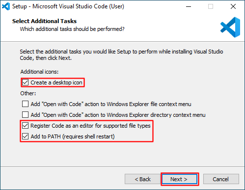
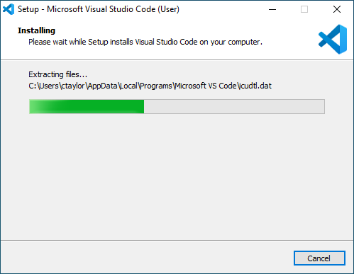
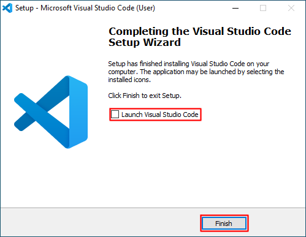

# Download Installer

1. Download the Visual Studio Code for Windows installer (https://aka.ms/win32-x64-user-stable).
2. Once the download is complete, run the installer (VSCodeUserSetup-x64-1.44.1.exe).

# Accept License Agreement

On the "License Agreement" screen,

1. Click the "I accept the agreement" radio button.
2. Click "Next >".

# Select Installation Destination

On the "Select Destination Location" screen,

1. Leave the default folder selection unchanged.
2. Click "Next >".

# Select Start Menu Folder

On the "Select Start Menu Folder" screen,

1. Leave the default folder selection unchanged.
2. Click "Next >". 

# Additional Options

On the "Select Additional Tasks" screen,

1. Make sure these checkboxes are checked:
   * "Create a desktop icon"
   * "Register Code as an editor for supported file types"
   * "Add to PATH"
2. Click "Next >".

# Start Installation

On the "Ready to Install" screen, click "Install".

# Installation Progress

The next screen shows you the progress of the installation.

# Finish Installation

On the "Completing the Visual Studio Code Setup Wizard" screen,

1. Uncheck "Launch Visual Studio Code".
2. Click "Finish".

