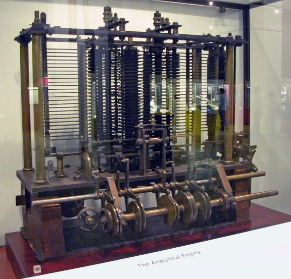
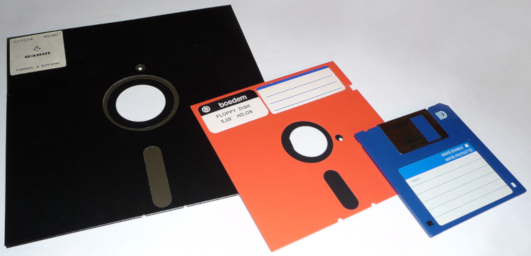

# Introduction

---

## Goals

1. Goal of course: Learn to think like a programmer
2. Goal of this lesson: Write and run two Python programs
   1. Hello world
   2. Hello NAME

---

## Lesson Overview

1. Set up a Python development environment
2. Approaching programming
3. Approaching Python
4. Strings, variables, and functions
5. The `print()` function
6. Hello, world!
7. The `input()` function
8. Hello, NAME!

---

# Getting Set Up

---

## Enable File Extensions in Windows Explorer

---

## Install Visual Studio Code

---

## Install GitHub Desktop

---

## Install Anaconda

---

# Approaching Programming

---

## What was Programming?

Started as a way to do math on computing machines.



---

## Ada Lovelace, The First Programmer


---

## Computers in 1924


---

## What is Programming?

* There's still math, sure...
* But nowadays, it's so much more than math.
* It's like being an architect, a poet, and a detective all at once.

---

## Code is Like a Coworker

Meet Tom.


---

## Exercise

Make a PB&J sandwich

---

# Bugs and debugging

---

## The First Bug


---

## Error Messages

1. When things go wrong, Tom doesn't communicate very clearly.

    ```python
    print(Hello, world!)
    #  File "<stdin>", line 1
    #    print(Hello, world!)
    #                      ^
    #  SyntaxError: invalid syntax
    ```

2. Error messages are your friend.
3. Google, Google, Google.

---

# Approaching Python

---

## What is Python?

1. A user-friendly, general-purpose programming language
   * User-friendly: Much easier to use than most other popular languages
   * General-purpose: Can be used to write all sorts of programs
2. An interpreter that translates Python code into CPU instructions

---

## What is Python used for?

* Web development
* Systems administration
* Data science and big data
* Machine learning/AI

---

## The Python REPL

* *REPL*: *R*ead-*E*valuate-*P*rint *L*oop
* Launching the Python REPL
* Exiting the Python REPL

---

# Comments

---

## About Comments

* A way to leave notes to yourself in your code
* Code that Python will ignore

---

## Single-Line Comments

* Start with a pound sign/hashtag
* End when the line ends

    ```python
    # This is a single-line comment.
    'Hello, world!'
    ```

* Can start anywhere within a line

    ```python
    'Hello, world!'  # Also a comment.
    ```

---

## Multi-Line Comments

* Start and end with three sets of quotation marks

    ```python
    """
    Here's a multi-line comment.
    It goes for as many lines
    as you want.
    """
    ```

---

## Commenting Things Out

* Super helpful during debugging
* Lets you remove code without deleting it

    ```python
    'This code will execute.'

    # 'This code will not execute.'
    ```

---

# Strings

---

## About Strings

* *String*: A groups of characters all lumped together
* *Character*: A single letter, number, or symbol
* Two types of strings:
  1. Single-line
  2. Multi-line

---

## Single-Line Strings

* Wrap in single or double quotes
* Idiomatic style: single quotes

    ```python
    'This is a string.'  # Most common form.
    "This is a string."  # Also works.
    ```

* Mixing quotes will cause a SyntaxError

    ```python
    'This is not a string."
    "This is not a string.'
    ```

---

## Mixing Quotes

* Mixing quotes has its uses.

    ```python
    "Python's great!"

    'They said, "Python is great!"'
    ```

* Sometimes we have to *escape* a quote.

    ```python
    'They said, "Python\'s great!"'

    'Don\'t need to mix quotes this way.'
    ```

---

## Multi-Line Strings

* Wrap in three sets of single quotes or three sets of double quotes
* Idiomatic style: double quotes

    ```python
    # Most common:
    """This is a
    multi-line string"""

    # Also works:
    '''This is a
    multi-line string'''
    ```

---

---

## Concatenation

* A fancy Latin way of saying "chaining together"
* Two main ways to concatenate strings:
  1. Addition
  2. Repetition

```python
'Concatenation ' + 'by ' + 'addition'
# >>> 'Concatenation by addition'

'Repetition' * 3
# >>> 'RepetitionRepetitionRepetition'
```

---

# Variables

---

## About Variables

* *Variable*: Basically, putting a nametag on something in Python
* Create a variable with an *assignment expression*.

    ```python
    my_variable = 'A string'
    ```

* *Reference* a variable by using its name.

    ```python
    my_variable
    # >>> 'A string'
    ```

---

## Anatomy of an Assignment Expression

```python
  my_variable = 'A string'
# |----1----| 2 |---3----|
```

1. Name
2. Assignment operator
3. Value

---

## Rules for Variable Names

* Can only contain letters, numbers, and underscores

    ```python
    my_variable = 'foo'    # This works
    my_variable_2 = 'bar'  # This works, too
    my_variable! = 'baz'   # SyntaxError
    ```

* Can't start with a number

    ```python
    my_variable_1 = 'quux' # This works
    1st_variable = 'spqr'  # SyntaxError
    ```

* Can't be a keyword (see next slide)
* Idiomatic style: `snake_case`

---

## Keywords

```python
False     await       else       import      pass

None      break       except     in          raise

True      class       finally    is          return

and       continue    for        lambda      try

as        def         from       nonlocal    while

assert    del         global     not         with

async     elif        if         or          yield
```

---

# Functions

---

## About Functions

* *Function*
  1. A bunch of code,
  2. Which takes data and does something with it,
  3. Grouped under one nametag.

---

## About Functions, cont.

* They look like variables but with parentheses at the end.

    ```python
    my_function()
    ```

* Many take *arguments*: values or variables *passed in* between the parentheses.

    ```python
    my_function('argument')
    my_function(foo)
    ```

* They *return* values, which can be assigned to a variable.

    ```python
    foo = my_function('bar')
    ```

---

## Look Familiar?

* Similar notation to mathematical functions:  
  
    $$y = f(x)$$

    ```python
    y = f(x)
    ```

* A Python function takes whatever you put between the parentheses, does something with it, and returns a value.

---

# `print()`

---

## About `print()`

* Doesn't have anything to do with printers (anymore, at least)
* Name is a relic of the past, like using a picture of a floppy disk for the "save" icon

---

Floppy disks



Save icon


---

## About `print()`, cont.

* What it does: takes argument(s) and shows them on the screen

```python
print('Hello, world!')  # Single argument

print('Hello,', 'world!') # Multiple arguments
```

---

# Your First Program

---

## `hello_world.py`

1. Open `hello_world.py` in VS Code.  
   (".py" is the file extension for Python files.)
2. In `hello_world.py`, replace

    ```python
    # Your code here...
    ```

    with

    ```python
    print('Hello, world!')
    ```

    and save the file.

---

## Run `hello_world.py`

1. Open the terminal in VS Code.
2. In the terminal, type

    ```bash
    python hello_world.py
    ```

    and hit Enter.

3. The text "Hello, world!" should appear inside the terminal.

---

## Hello World Experiment

What happens if we do this?

1. Change `hello_world.py` from

    ```python
    print('Hello, world!')
    ```

    to

    ```python
    'Hello, world!'
    ```

2. Save and run the program.

---

# `input()`

---

## About `input()`

* Actually does what its name says
  1. Pauses program execution
  2. Prompts the user to type something
  3. When the user hits Enter, returns what they typed
  4. Resumes program

---

## Using `input()`

```python
user_name = input('Type your name, then press Enter: ')
#---2---|         |----------------1-----------------|

print('Hello,', user_name + '!')
#               |---3---|
```

1. User prompt
2. Assign user input to a variable
3. Print user input

---

## `hello_name.py`

1. Open `hello_name.py` in VS Code.  
   (".py" is the file extension for Python files.)
2. In `hello_name.py`, replace

    ```python
    # Your code here...
    ```

    with

    ```python
    user_name = input('Type your name, then press Enter: ')
    print('Hello,', user_name + '!')
    ```

    and save the file.

---

## Run `hello_name.py`

1. Open the terminal in VS Code.
2. In the terminal, type

    ```bash
    python hello_name.py
    ```

    and hit Enter.

3. Interact with the program.
