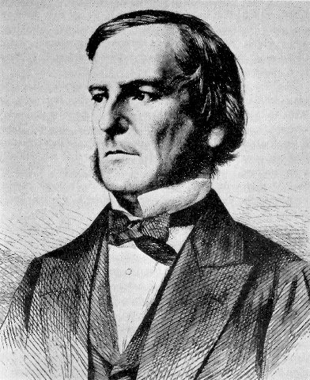

# Numbers and Strings

---

## Goals of the Lesson

1. Update `hello_name.py` to capitalize the user's name and say how long it is
2. Write a number-guessing game

---

## Lesson Overview

1. Types
2. Methods
   1. About methods
   2. String methods
   3. Exercise: Modify hello_name.py
3. Numbers
   1. `int`
   2. `float`
4. Booleans
   1. About Booleans
   2. Truth testing
   3. Truthiness
5. Conditional logic
   1. `if`
   2. `if...else`
   3. `if...elif...else`

---

# Types

---

## About Types

* *Type*: The blueprint that shows what an object is like and how it will act
* In Python, a synonym is `class`.
* Every object has a type.
* Some common types:
  * `str` (strings)
  * `int` (integers/whole numbers)
  * `float` (decimal numbers)
  * `bool` (Booleans: `True` and `False`)

---

## `type()`

The `type()` function lets you plug in an object and see what class it is.

```python
type('foo')
# <class 'str'>

type(5)
# <class 'int'>

type(2.0)
# <class 'float'>

type(True)
# <class 'bool'>
```

---

# Methods

* *Method*: A function built into a type blueprint
* Determine how an object acts
* *Dot notation* lets you access an object's methods

    ```python
    some_object.method_name()
    ```

---

## String Methods

Useful string methods:

* `upper()`
* `lower()`
* `strip()`
* `replace()`
* `split()`

---

## `upper()`

* Converts a string to uppercase
* Takes no arguments

```python
'Hello, world!'.upper()
# 'HELLO, WORLD!'
```

---

## `lower()`

* Converts a string to lowercase
* Takes no arguments

```python
'Hello, world!'.lower()
# 'hello, world!'
```

---

## `strip()`

* Removes whitespace (spaces, tabs, line breaks) from the beginning and end of a string
* Takes no arguments

```python
'    Hello, world!     '.strip()
# 'Hello, world!'
```

```python
"""

    Hello, world!

""".strip()
# 'Hello, world!'
```

---

## `replace()`

* Takes two arguments:
  1. A search string
  2. A replacement string

    ```python
    'string'.replace(search, replacement)
    ```

* Finds all occurrences of `search` in the string and replaces them with `replacement`

```python
'Hello, world!'.replace('H', 'J')
# 'Jello, world!'

'Hello, world!'.replace(', world', ' there')
# 'Hello there!'
```

---

## `split()`

* Breaks a string up into a list of *substrings* based on a separator
* Takes one argument: the separator to search for
* Can use `split()` without passing in a separator; its *default value* is a space (`' '`)

```python
'Hello, world!'.split(',')
# ['Hello', ' world!']

'A B C'.split()
# ['A', 'B', 'C']
```

---

## `len()`

* A function, not a method
* Returns the number of elements in a collection
* Strings are collections of letters, numbers, and characters
* So `len('some string')` returns the length of the string

```python
len('Hello, world!')
# 13

len('Python is the greatest.')
# 23
```

---

## Exercise: Modify hello_name.py

* Use `upper()` method and `len()` function to print out name in caps and state the name length
* E.g. “Hello JAKE, your name is 4 letters long”

---

# Numbers

---

## Notes on Notation (1)

* In math, we use commas as thousands separators.

    $$x = 1,234,567,890$$

* When programming, we can't do that.
* Python sees comma-separated values as something totally different.

```python
x = 1,234,567,890
print(x)
# (1, 234, 567, 890)
```

---

## Notes on Notation (2)

* Two ways around the problem of separators
  1. Don't use them
  
      ```python
      x = 1234567890
      print(x)
      # 1234567890
      ```
  
  2. Use underscores
  
      ```python
      x = 1_234_567_890
      print(x)
      # 1234567890
      ```

---

## `int`

* *Integer*: A whole number (no decimals)
* Can be positive, negative, or 0
* Unlimited length (no `int` vs. `short` vs. `long`)
* `int()` function converts a `str` or `float` to an `int`, if possible

```python
x = 8723578961209875208912
print(type(x))
# <class 'int'>

y = -1
print(type(y))
# <class 'int'>

z = 0
print(type(z))
# <class 'int'>
```

---

## Floats

* *Floating-point number*: A number with a decimal point (even if all decimal places are 0)
* Python's floating-point type: `float`
* Can be positive, negative, or zero
* Arbitrary precision (no `float` vs. `double` vs. `decimal`)
* `float()` function converts an `int` or `str` to a `float`, if possible

```python
x = 1.234
print(type(x))
# <class 'float'>

y = -21897549086387234.1908707895
print(type(y))
# <class 'float'>

z = 0.0
print(type(z))
# <class 'float'>
```

---

## Notes on Notation (3)

* When all decimal places are 0, you don't have to write them.

```python
x = 0.
print(type(x))
# <class 'float'>

y = 2345.
print(type(y))
# <class 'float'>

z = -899348.
print(type(z))
# <class 'float'>
```

---

## Notes on Notation (4)

* Scientific notation (calculator-style) works
* Creates `float`s

```python
x = 1e6
print(x)        # 1000000.0
print(type(x))  # <class 'float'>

y = 4893e-4
print(y)        # 0.4893
print(type(y))  # <class 'float'>
```

---

# Booleans

---

George Boole (1815--1864)



---

## About Booleans

* *Boolean*: A truth value
* Python type: `bool`
* Only two values: `True` and `False` (notice the capital letters!)

---

## Truth Testing

* Booleans are the result of truth tests
* Equality and inequality
* Identity
* Logical operators

---

## Equality and Inequality

| Python | Math   | Meaning                  |
|--------|--------|--------------------------|
| `==`   | $=$    | equal to                 |
| `!=`   | $\neq$ | not equal to             |
| `>`    | $\gt$  | greater than             |
| `<`    | $\lt$  | less than                |
| `>=`   | $\geq$ | greater than or equal to |
| `<=`   | $\leq$ | less than or equal to    |

---

## Equality and Inequality, cont.

* Most obvious use: comparing numbers

```python
1 == 2  # False
1 < 2   # True
```

* Can compare strings, too
* Like alphabetization, but capital and lowercase are different
* Capital A-Z come first, then lowercase a-z

```python
'a' == 'A'  # False
'a' < 'b'   # True
'Z' < 'a'   # True
```

---

## Identity

* Identity operator: `is`
* Some subtle differences with `==`
* Really only need to remember:
  * `is True`
  * `is False`
  * `is None`

---

## Logical Operators

* Compare the truth values of two objects
* Three logical operators
  * `and`
  * `or`
  * `not`

---

## `and`

* If (and only if) both values are `True`, returns `True`
* Otherwise, returns `False`

```python
True and True  # True

True and False   # False
False and True   # False
False and False  # False
```

---

## `or`

* If at least one value is `True`, returns `True`
* If both values are `False`, returns `False`

```python
True or True   # True
True or False  # True
False or True  # True

False or False  # False
```

---

## `not`

* If a value is `True`, returns `False`
* If a value is `False`, returns `True`

```python
not False  # True

not True   # False
```

---


---

## Truthiness

* *Truthiness*: The truth value of an object
* Most objects are truthy
* A handful are falsy
  * `False`
  * `None`
  * Zero
  * Empty collections

```python
bool(False)  # False
bool(None)   # False
bool(0)      # False
bool('')     # False
```

---

# Conditional Logic

---

## About Conditionals

* Change program flow based on results of truth tests
* Conditional blocks vs. conditional expressions
* Three forms of conditional blocks:
  1. `if`
  2. `if...else`
  3. `if...elif...else`

---

## Notes on Notation (5)

* In Python, blocks are denoted by indentation
* Each level should be indented four spaces in from the previous level
* Inconsistent indentation will cause an `IndentationError`

```python
if condition_1:      # Level 1
    if condition_2:  # Level 2
        result       # Level 3
```

---

## `if`

* Runs code inside its block if the condition evaluates to `True`

```python
if 1 == 2:
    # Python will skip this code:
    print('1 equals 2')
```

```python
x = 5

if x == 5:
    print('x equals 5')
```

---

## `if...else`

* Code inside `else` block runs if the condition evaluates to `False`
* Don't need to put a condition after `else`

```python
x = 10

if x == 5:
    print('x equals 5')
else:
    print('x does not equal 5')
```

---

## `if...elif...else`

* Lets you stack multiple `if...else` blocks without having to keep indenting
* `elif` is short for `else: if...`

```python
x = 5

if x > 5:
    print('x is greater than 5')
elif x < 5:
    print('x is less than 5')
else:
    print('x equals 5')
```

---

## Exercise: Number Guessing Game

* User inputs a number to have one guess at the correct number
* Number is not random: student decides static pre-determined number in the code
* Output should tell them if number is lower, higher, or correct
